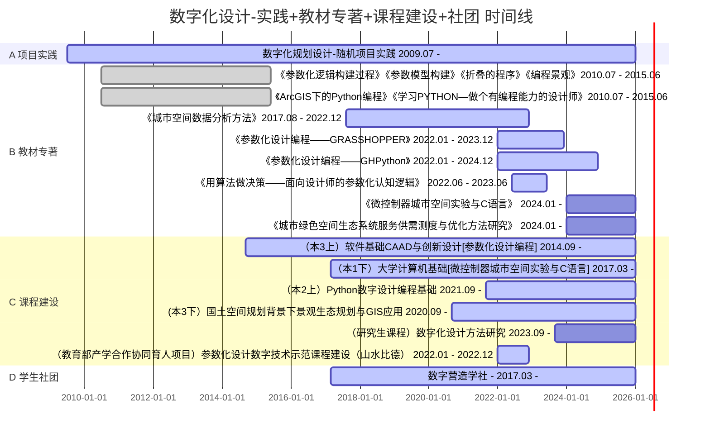

> Created on Sun Apr 24 15:34:44 2022 @author: Richie Bao（西建大）

# 数字化设计教学实践与数字营造学社

西建大建筑学院-风景园林系-数字化设计教学建设教师成员：包瑞清；王丁冉

## 1. 时间线

## 2 课程之间及课程与规划设计的关系

 

## 3. 已开课情况问题与调整

| 课程名称 |专业结合-别名| 简介  |信息| 问题  | 回应与调整  | 备注|
|---|---|---|---|---|---|---|
| 大学计算机基础”  |微控制器城市空间实验与C语言|  随着计算机技术的发展，网络的普及，在线课程的日益蓬勃，大学计算机基础课程的内容势必随着技术的发展，以及学习环境的改善而更新迭代。面对工业4.0智能化时代的悄然来临，以及设计规划行业在机器建造、智能化设计、互动艺术装置及虚拟现实等设计内容上的拓展，大学计算机基础结合专业特点，以传统教学目的为内核，面向当前的新技术发展水平，结合创新创业，以应用Ｃ语言编程开源硬件（微处理器）建造互动艺术装置，和实验设备原型为目的，学习计算机技术，硬件知识和编程语言，培养动手实践创新的能力和良好的编程逻辑思维能力。 | 课程类型：通识核心课程  学时：32 学分：2 年级：大一下 对象：风景园林 | 1.大一新生很难意识到“机器人建造”和C语言对规划设计的影响，选课和学习积极性弱； 2.国内学生受英语语言影响，编程学习会显吃力； 3. 讲授时，没有把握节奏和好的引导，导致学生主观判断学习起来会吃力，无法完成课程； 4. 教材选用英文教材时，学生目前无法接受增加的学习难度；  5. 微控制器、传感器等硬件教学条件欠缺。 | 1.尝试借助学社示范效应； 2.暂时无解; 3.编写该类教材与调整教学方法（预计2024年启动）； 4.选中文教材，或尝试改双语（即含重点中文）； 5. 结合学校数字化实验室建设。    | /  |
| Python数字设计编程基础  |无| 基于编程语言的设计规划方法是现在和未来设计重要内容之一，Python编程语言在城市规划、风景园林和建筑领域中的大数据分析、智能规划、数字化设计、机器建造中具有举足轻重的作用。依托规划、风景和建筑学科基因，以编程设计思维为引导，讲授Python基础、数据处理分析技术、拓展至应用语言来解决本学科问题的方法，并一窥机器学习的门径。课程不断反复简单到复杂的代码解析和编程训练，达到正确引导进入Python世界，培养编程逻辑思维能力，养成良好的写代码习惯，掌握建立系统项目工程方法的目的。 | 课程类型：通识核心课程  学时：24 学分：1.5 年级：大二上 对象：建筑、规划、风景园林  | 1. 2022年秋季选课人数约百人，课程负担重，无法照顾全； 2. 选课涉及建筑、规划和景观（建筑专业约占90%），对位专业方向如何调整； 3. 首次开课，未能把握深度，造成难度偏高； 4. 与专业结合就会增加内容难度，如何引导编程技术到专业的应用； 5.尝试基础速学与专业结合的教学途径失败。    | 1. 增加线上教学图文短视频，减轻线下负担。扩充数字化研究方向具有编程能力的教师资源分担课程； 2. 以基础为主，分专业布置专项应用； 3-4-5. 重新设计配置教学内容，基础为主、数据分析拓展，专业方向应用示范结合途径；  | /  |
| 软件基础CAAD与创新设计  |  参数化设计编程——GRASSHOPPER | 数字化设计技术已经得到空前的发展，推动着设计规划领域依托传统经典的设计方法，结合当前的新技术，不断的实现创新，并朝着智能化设计的方向上不断的推进。数字化设计发展的劲势，影响着经典的设计思想，新的设计思维方式不断涌现，尤其参数化设计技术在其中具有举足轻重的作用。设计已经不仅是传统意义上的空间思维，可以借助参数化技术融入数理逻辑思维，加入更多，更全面的设计影响因素，引导空间的设计，以及空间的评估，甚至生成适合的空间形式。该课程在讲述参数化设计的同时，不断的融入编程处理数据的方法（参数化的核心），拓展未来设计的创新空间。 | 课程类型：通识核心课程  学时：24 学分：1.5 年级：大三上  对象：风景园林  | 1. 基础速学，强调专业课结合（例如‘风景园林工程与技术’），增加了难度，教学效果一般，甚至不理想；  2. 参数化技术与参数化设计方法（思维）并未很好的结合起来，造成学生理解深度不到位； 3. GRASSHOPPER为节点式编程，专业又多偏向空间思维训练，之前未选择相关C语言或者Python语言学习的同学，学习GH会有一定难度； 4.考核方式标准不明确。  |  1. 结合2022年产学合作协同育人项目，重新设计教材，调整讲授内容； 2. 增加技术到方法思维转变的引导； 3. 增加基础讲授内容，强调实操训练； 4. （待定）结合2022秋季课程，探索途径。 |/|
|国土景观评价与保护|国土空间规划背景下景观生态规划与GIS应用|课程主要涉及的核心知识领域为“地景规划与生态修复”，并与城乡规划专业核心知识领域“城乡生态环境与基础设施规划”产生一定的交叉。主要培养学生在国土、流域、区域和土地利用等综合规划，以及旅游区、风景名胜区、自然保护区和市域空间运用景观生态学原理探索可持续景观战略和规划设计创新的途径。了解景观生态规划的发展演变过程，掌握国土、区域、流域等中大尺度下生态规划的方法与程序，熟悉景观生态规划的分析与评价方法，并加强GIS技术对规划设计的应用与支撑。|课程类型：专业方向选修课程; 学时：24; 学分：1.5; 年级：大三下; 对象：风景园林、城乡规划、建筑学。|1.风景园林专业的前置课程在国土空间规划相关知识、概念方面铺垫不足，相对而言规划专业的同学适应性更强； 2.前置学习尺度偏微观，对于中大乃至区域尺度的认知具有一定难度； 3.需要学生有效将景观生态学原理理解并转化应用，也存在一定的障碍； 4.课程兼顾理论与GIS技术应用，相关技术铺垫不足，导致课内GIS技术的教授深度有限。 |1.风景园林专业可以加强在地景规划与生态修复方向，前置理论课程的铺垫，引导学生选修规划专业开设的相关理论课程； 2.暂时难以改变前置设计课的对象与尺度，考虑在调整1中通过选修理论课等形式扩宽视野，在本门课程中强化从学生熟悉的尺度向更大尺度过渡； 3.本门课程在内容上应当与前置的景观生态学原理进行有效衔接，同时，与后置的设计课形成课程链； 4.课程体系中应当增加GIS实践课程内容，现有课程偏理论。|/|

**数字化设计相关课程均为选修课，未真正纳入专业教学体系，必然会制约数字化设计的发展。**

## 4. 近期新开课预期与计划

**课程名称：**数字化设计方法研究

**内容：**综合应用数字化设计技术，包括基于Python语言的数据分析；基于C语言的微控制器实验设备建造；和基于GH的参数化设计，探索专业方向上解决相关问题的数据处理途径和提出新方法。

**对象：**建筑，景观，规划专业的研究生课程

**预计开新课时间：**2023秋季或2024年春季

## 5. 产学研与教材专著更新

* [《参数化设计编程——GRASSHOPPER》](https://richiebao.github.io/parametric_design_coding_grasshopper/#/)－进行中

* [《参数化设计编程——GHPython》](https://richiebao.github.io/parametric_design_coding_GHPython/#/)－进行中

* [《用算法做决策——面向设计师的参数化认知逻辑（CATERPILLAR）》](https://richiebao.github.io/parametric_design_coding_module/#/)－启动中

* [《城市空间数据分析方法》（该版本已停更）](https://richiebao.github.io/Urban-Spatial-Data-Analysis_python/#/)     [城市空间数据分析方法-初版探索代码（该版本已停更）](https://github.com/richieBao/python-urbanPlanning) - 进入终版，准备出版阶段

* [《城市绿色空间生态系统服务供需测度与优化方法研究》]() - 待

## 6. 数字营造学社

 

2017年，由王丁冉、包瑞清老师引导建立的数字化设计方向学生[学习社团](https://digit-x.github.io/digit_x/#/)，目前由学生自行组织活动。

**价值：**

1. 能够把想学习数字化设计的同学聚集在一起，互相敦促学习；
2. 学社日常活动，和学社同学应用数字化的方法可以激发周围同学的兴趣，关注、尝试学习数字化设计；
3. 参与到教师教材，和产学协同活动中，一方面为学习者，实践者；另一方面问题反馈，为教材内容调整提供建议；
4. 学社网站包括学社活动，和教师更新的历年课件，及相关探索，可以为本校学生和外校学生提供更易于接近了解数字化设计，和学习的机会。

