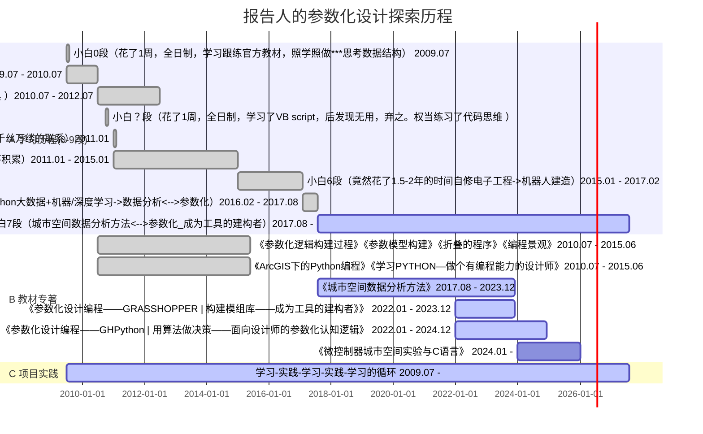

> Created on Fri Dec 23 07:23:20 2022 @author: richie bao

# 参数化设计——小白->实践->探索

> 成为工具的建构者——具有编程能力的设计师！

## :o: 踩过的坑（人生苦短）

> 你我以为的参数化设计领域是否相同？

:interrobang: Microsoft 365究竟是为谁服务的？为格式（样式）困扰值得吗？和做笔记的重要性

* 做笔记的目的：

1. 快速记录，不用过度关心样式格式；
2. 代码格式高亮显示，具有易读性；
3. 方便文件管理，可有序无限扩展；
4. 易于搜索，快速定位搜索主题；
5. 可以发布在线，在线更新**知识积累**，随时随地查看及分享；
6. 方便不同平台、格式转换，具有广泛的弹性，易于迁移；
7. **自主性**。

| 轻量级标记语言  | 解释器  |集成式|在线版|
|---|---|---|---|
|    [markdown](https://www.markdownguide.org/)|    [Visual Studio Code（VSC）](https://code.visualstudio.com/)  |   [jupyterlab](https://jupyter.org/)| [Colab](https://colab.research.google.com/notebooks/welcome.ipynb?authuser=1#scrollTo=5fCEDCU_qrC0)  [kaggle](https://www.kaggle.com/code)|

:interrobang: 做了那么多设计，写了那么多逻辑代码，为什么新的设计任务还要重新思考写逻辑？ 

* 解决的方法⟶建立模组库|包+案例的必要性

1. 对于GH，建立模组；

 

 

2. 对于Python，建立包。

例如：[城市空间数据分析方法-USDA 库手册](https://richiebao.github.io/USDA_PyPI/#/)

:interrobang: 你在做别人已完成的工作，为什么要从0开始及必须从0开始？

避免重复造轮子！

已有扩展或库不稳定时，需要自行写代码。

:interrobang: 什么都需要藏着掖着吗？版权与分享精神，共建社区

:interrobang: 参数化设计工具是工具的按钮吗？，参数化设计是工具也不是工具

:interrobang: 参数化设计只是参数化吗？横行霸道的领域拓展

:interrobang: 太多东西，麻爪了？抓住核心——代码（编程）

:interrobang: 学写代码背完就了之了？练习实践反复的不断重复

##  :shipit: 学习途径推荐

## 1个地球，1个世界！