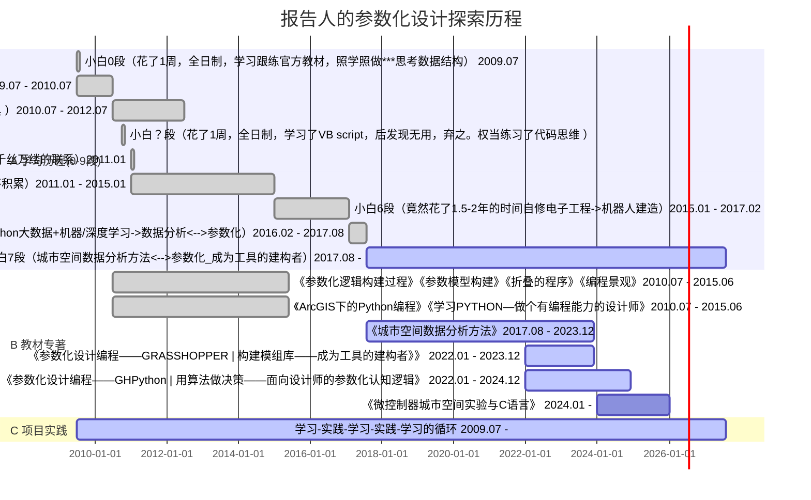

> Created on Fri Dec 23 07:23:20 2022 @author: richie bao

# 参数化设计——小白->实践->探索

> 成为工具的建构者——具有编程能力的设计师！

## :o: 踩过的坑（人生苦短）

> 你我以为的参数化设计领域是否相同？

:interrobang: Microsoft 365究竟是为谁服务的？为格式（样式）困扰值得吗？和做笔记的重要性

* 做笔记的目的：

1. 快速记录，不用过度关心样式格式；
2. 代码格式高亮显示，具有易读性；
3. 方便文件管理，可有序无限扩展；
4. 易于搜索，快速定位搜索主题；
5. 可以发布在线，在线更新**知识积累**，随时随地查看及分享；
6. 方便不同平台、格式转换，具有广泛的弹性，易于迁移；
7. **自主性**。

| 轻量级标记语言  | 解释器  |集成式|在线版|
|---|---|---|---|
|    [markdown](https://www.markdownguide.org/)|    [Visual Studio Code（VSC）](https://code.visualstudio.com/)  |   [jupyterlab](https://jupyter.org/)| [Colab](https://colab.research.google.com/notebooks/welcome.ipynb?authuser=1#scrollTo=5fCEDCU_qrC0)  [kaggle](https://www.kaggle.com/code)|

:trident: (demo)

:interrobang: 做了那么多设计，写了那么多逻辑代码，为什么新的设计任务还要重新思考写逻辑？ 

* 解决的方法⟶建立模组库|包+案例的必要性 🠊 拥有自行构建可不断扩展的工具库（代码库、模组库、算法库）——不一样的设计库

1. 对于GH，建立模组；(:trident: (demo))

 

 

2. 对于Python，建立包。

例如：[城市空间数据分析方法-USDA 库手册](https://richiebao.github.io/USDA_PyPI/#/)

:interrobang: 你在做别人已完成的工作，为什么要从0开始及必须从0开始？

避免重复造轮子！1个地球，1个世界！

**互联**网改变了很多事，这尤其在代码世界，无以计数的研究成果很多都已代码形式存在，让研究成果/实验更容易再现分享，甚至研究的过程就是代码书写的过程（工具构建的过程）。这非常容易的研究实验再现方式，和无以计数集“世界之力”的数据处理方法，都加快了知识的迭代更新。

已有扩展或库不稳定时，需要自行写代码。...

:interrobang: 什么都需要藏着掖着吗？版权与分享精神，共建社区

 [GitHub](https://github.com/)，[kaggle](https://www.kaggle.com/)，[Colab](https://colab.research.google.com/notebooks/welcome.ipynb?authuser=1#scrollTo=5fCEDCU_qrC0)， [huggingface](https://huggingface.co/)，...

> 核心技术也许例外

:interrobang: 参数化设计只是参数化吗？只是设计吗？横行霸道的领域拓展

<iframe 
  width="auto"
  height="375"
  src="./html/Parameterized_overview_chart.html"
  frameborder="0"
  allow="accelerometer; autoplay; encrypted-media; gyroscope; picture-in-picture"
  allowfullscreen>
</iframe>

[food4Rhino](https://www.food4rhino.com/en)；[Grasshopper3D](https://www.grasshopper3d.com/)

:interrobang: 太多东西，麻爪了？抓住核心——代码（编程）

 ①设计尸VS程序猿②

1. 空间思维和逻辑思维之间从跳跃到融合，基本上就完成了用代码写设计的思维提升（也是转变）；
2. 参数化设计虽然是一种设计方式亦或设计思维，但是核心的东西还是对代码的理解，即从工具构建者的角度去看待问题，例如，通常设计师是到处寻找工具，但是现在很多工具自行处理，且能够更好的融入到设计流中；
3. 代码程序不计其数，可以先浏览知道有什么，打牢编程基础和专业基础，用到什么时现学就可以。

:interrobang: 学写代码背完就了之了？练习实践反复的不断重复

🠋

##  :shipit: 不妨挑战下

* 参数化设计部分

[完成度记录](https://richiebao.github.io/parametric_design_coding_grasshopper/#/./markdown/0_3_%E5%AE%8C%E6%88%90%E5%BA%A6%E8%AE%B0%E5%BD%95)

* Python编程部分

[完成度记录](https://richiebao.github.io/parametric_design_coding_GHPython/#/./markdown/pcs_0_%E5%AD%A6%E5%86%99%E4%BB%A3%E7%A0%81%E7%9A%84%E6%96%B9%E5%BC%8F)

> 学习Python等文本式编程语言，会加深理解参数化设计的深度，会拓展更多的可能性，因此如果想在参数设计上走的更远，学习Python非常必要。

推荐学习[城市空间数据分析方法](https://richiebao.github.io/USDA_CH_final/#/)

---

注释（Notes）：

① shutterstock，（<https://www.shutterstock.com/image-vector/friendly-ghosts-funny-spooky-cartoon-spirit-1454365862>）。

② pinteres，（<https://www.pinterest.com/pin/689121180499310381/>）。

