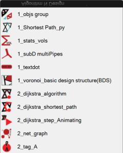
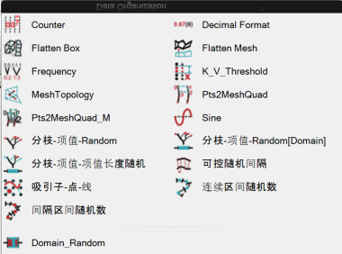
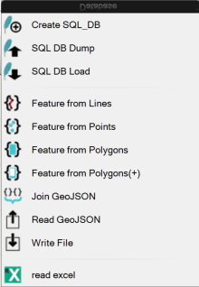
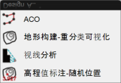
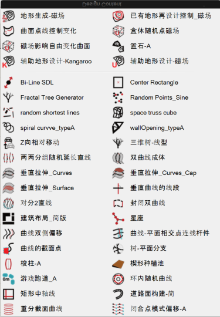
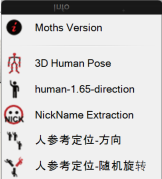
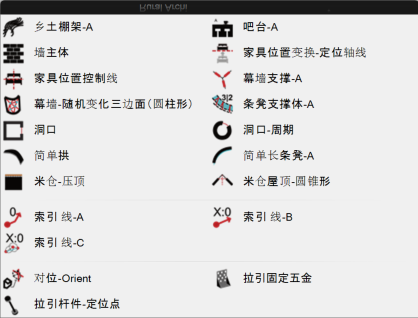
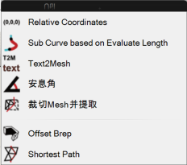

> Created on Tue Dec  6 09:43:41 2022 @author: richie bao

# 参数化设计数字技术示范课程建设结题报告

## 1. 年终总结报告在线研讨会

**主题：**教育部产学项目——参数化设计数字技术示范课程建设结题年终总结报告在线研讨会（西建大-山水比德）

**时间：**2022年12月17号上午9：00-11：00（周六）

**时长：**约2个小时左右

**形式：**在线研讨（# 腾讯会议：357-409-664）

**环节：**
1. 嘉宾介绍
2. 项目介绍与完成情况
3. 分组报告： 山水比德数字组，数字营造学社数字组
4. 嘉宾交流
5. 会议总结

**嘉宾：**

高校教师： 袁旸洋老师（东南大学建筑学院副教授），杨晨老师（同济大学建筑与城市规划学院副教授）；

企业领导：梅卫平先生（山水比德监事会主席），孙晓峰先生（山水比德全球创新中心副总经理）,谢德瑞先生（山水比德信息支持中心总监），宋冲先生（山水比德数字科技中心元宇宙事业部产品总监）。

## 2. 合作目标和主旨

**目标：**完成参数化设计数字技术示范<u>课程建设</u>，落实课程教学，付诸于实施；同时为企业员工数字化设计培训提供可实施的<u>课程系统</u>；完成教学<u>实验库（代码库、模组库）</u>的建立，结合实际应用为教学提供素材，也能够为企业实际项目提供支撑；完善<u>在线网络课程平台</u>，实现课程知识分享；利用双方优势资源，把科研成果转化为可以带来经济效益的生产力，以提升企业创新能力和技术水平，在实践中为企业培养高科技人才。

**主旨：**成为工具的建构者——具有编程能力的设计师！

## 3. 完成内容（截至2022年末）

### 1）Moths工具集构建

以“成为工具的建构者”理念为基础，结合设计内容、融入设计逻辑、集成整合辅助设计和分析的参数化设计工具集。

工具集构建的目的：

1. 辅助于设计生产实践途径的探索；
2. 数字化和智能化设计方法的探究；
3. 数据信息化与B（L,C）IM的结合；
4. GH参数化与Python编程协同方法。

__Moths工具集完成的内容：__

|  序号 |  板块 | 内容  | 说明  | 数量统计  |备注|
|---|---|---|---|---|---|
|  1 | Algorithm N Design  |    | 常用算法汇集及应用  | 11  ||
|  2 | Data Organization  |    | 数据组织方法  | 18  ||
|  3 |  Database |    |   | 11  ||
|  4 | Design  Analysis |    | 数据库及数据文件读写  |  4 ||
|  5 | Design Content  |    | 设计辅助和生成  |  40 ||
|  6 | Info  |    | 设计用信息  |  6 ||
|  7 | Rural Archi  |    |（乡村、古建筑）等专项设计辅助   |  20 ||
|  8 |  Util |    |  一般常用工具 | 7  ||
| 汇总  |   |   |  |   117 ||

### 2）教材编写情况和网络平台在线更新

教材是从事教学活动的基础工作，目前随着数字化设计的发展，以GH为平台的参数化设计书籍不断增多，从参数化编程技术到数字化设计均有所涉猎，为了推进数字化、参数化设计领域的发展尽微薄之力，以成为工具的建构者和践行者为目标分别编写GH部分（可视化节点编程）和GHpython部分（文本式编程），强化代码编程训练基础和结合设计的数字化方法探索。

2022年主要完成了基础部分的编写工作。

| 父级-基本完成  | 父级-部分完成  |  父级-待完成 |  子级-基本完成 | 子级-部分完成|子级-待完成  |
|---|---|---|---|---|---|
|  :red_circle:  | :black_circle:  |  :white_circle: | :heavy_check_mark:  |:black_square_button: |:white_check_mark:  |

:light_check_mark: 

A. [《参数化设计编程——GRASSHOPPER | 构建模组库——成为工具的建构者》](https://richiebao.github.io/parametric_design_coding_grasshopper/#/)

* 前言 :white_circle:
* 指南 :white_circle:
* 完成度记录 :heavy_check_mark: 
* Moths-模组说明 :red_circle: 
    * Data Organization :heavy_check_mark:
    * Database :heavy_check_mark:
    * Design Analysis :heavy_check_mark:
    * Design Content :heavy_check_mark:
    * Info :heavy_check_mark:
    * Rural Archi :heavy_check_mark:
    * Util :heavy_check_mark:
    * Misc :heavy_check_mark:
* 1\. 准备 :red_circle:
    * 1.1 既是设计师，又是程序员 :heavy_check_mark: 
    * 1.2 GH 工具和编程习惯 :heavy_check_mark: 
* 2\. 数据类型、结构与空间几何 :red_circle: 
    * 2.1 数据类型与结构 :heavy_check_mark:
    * 2.2 空间定位-点、向量与参考平面 :heavy_check_mark:
    * 2.3 空间几何 :heavy_check_mark:
    * 2.4 建立模组库 :heavy_check_mark:
* 3\. 参数化项目流程 :black_circle:
    * 3.1 环境与分析_设计前 :heavy_check_mark: 
    * 3.2 概念设计->深化设计 :heavy_check_mark: 
    * 3.3 详细设计->扩初控制 :heavy_check_mark: 
    * 3.4 环境评估_设计后 :white_check_mark:
    * 3.5 施工与建造
* 4\. 动力学协同设计 :white_circle:
* 5\. 生态协同设计 :white_circle:
* 6\. 结构协同设计 :white_circle:
* 6\. 扩展库 :white_circle:      
* 7\. 空间数理逻辑思维 :white_circle:
* 书写规范 :red_circle:

B.[《参数化设计编程——GHPython | 用算法做决策——面向设计师的参数化认知逻辑》](https://richiebao.github.io/parametric_design_coding_GHPython/#/)

* 前言 :white_circle:
* 指南 :white_circle:

* 1\. 准备:red_circle: 
    * 1.1 第一个程序和工作流程，及GHPython和API :heavy_check_mark:
    * 1.2 书写代码的良好习惯-clean code :heavy_check_mark:
* 2\. Python 基础核心:red_circle: 
    * PCS_0 学写代码的方式 :heavy_check_mark:
    * PCS_1 善用print()，基础运算，变量及赋值 :heavy_check_mark: 
    * PCS_2 数据结构-list_tuple_dict_set :heavy_check_mark:
    * PCS_3 数据结构-string :heavy_check_mark:
    * PCS_4 基本语句-if_for_while_comprehension :heavy_check_mark:
    * PCS_5 函数-def_scope_args :heavy_check_mark:
    * PCS_6 函数-recursion_lambda_generator :heavy_check_mark:  
    * PCS_7 模块与包及发布-module_package_pypi :heavy_check_mark:
    * PCS_8 (OOP)类Classes-定义，继承，__init__()构造方法，私有变量/方法 :heavy_check_mark:
    * PCS-9 (OOP)类Classes-Decorators(装饰器)_Slots :heavy_check_mark:
    * PCS-10 异常-Errors and Exceptions :heavy_check_mark:
    * PCS-11 代码风格-Pyton Style Guide :heavy_check_mark:
    * PCS-12 拓展-Content Expansion :heavy_check_mark:
    * PCS_X 测验-练习 :heavy_check_mark:
* 3\. GHPython VS Python :black_circle:
    * 3.1 可调用的模块/库 :heavy_check_mark:
    * 3.2 组件式模块_逐步计算与算法解析（最短路径算法 Dijkstra's Algorithm，DA） :heavy_check_mark:
    * 3.3 工作流程(一个概念设计) :heavy_check_mark:
    * 3.4 数据库与数据文件 :black_square_button:
* 4\. 算法 VS 设计问题:white_circle: 
    * 4.# 代理模型 （Agent-based models，ABM） :white_check_mark:
    * 4.# 遗传算法 （Genetic Algorithms，GA） :white_check_mark:
    * 4.# 寻路算法（A* search algorithm） :white_check_mark:
    * 4.# 蚁群算法（Ant Colony Optimization, ACO） :white_check_mark:
    * 4.# 元胞自动机（Cellular Automata，CA） :white_check_mark:
    * 4.# 粒子群优化算法（Particle Swarm Optimization，PSO） :white_check_mark:
    * 4.# （） :white_check_mark:
* 5\. 机器学习（Machine Learning，ML）和深度学习（Deep Learning，DL）:white_circle: 
    * 5.1 ML-聚类模型 :white_check_mark:
    * 5.2 ML-回归模型 :white_check_mark:
    * 5.3 ML-分类模型 :white_check_mark:

* 6\. 专项研究:white_circle: 

* 参考文献 :white_circle: 
* 7\. 附录
    * CodingBat备份

### 3）教学实践

1. 已完成19次在线研讨会；
2. 已完成“Python数字设计编程基础”课程实践，课程信息如下：

| 名称  | 内容  | 名称  | 内容  |
|---|---|---|---|
|  **课程名称：** |  Python数字设计编程基础 |  **英文名称：** |  Python digital design coding for beginners |
|  **课程类型：** |  通识核心课程 | **课程编码：**  |  101683 |
|  **学    时：** |  24 | **课内实践学时：**  | 无  |
| **学    分：**  | 1.5  | **开课单位：**  |  建筑学院风景园林学系三年级设计教研室 |
| **适应对象：**  |  规划、风景和建筑专业 |  **先修课程：** |无   |
| **课程主要内容：**  |  基于编程语言的设计规划方法是现在和未来设计重要内容之一，Python编程语言在城市规划、风景园林和建筑领域中的大数据分析、智能规划、数字化设计、机器建造中具有举足轻重的作用。依托规划、风景和建筑学科基因，以编程设计思维为引导，讲授Python基础、数据处理分析技术、拓展至应用语言来解决本学科问题的方法，并一窥机器学习的门径。课程不断反复简单到复杂的代码解析和编程训练，达到正确引导进入Python世界，培养编程逻辑思维能力，养成良好的写代码习惯，掌握建立系统项目工程方法的目的。 |  **教学内容（日历）** | 同《参数化设计编程——GHPython \| 用算法做决策——面向设计师的参数化认知逻辑》——Python基础核心部分章节  |

## 4. 收尾工作和延续

2022年未完成和新拓展的工作内容将在2023-2024年内完成。

1. 《参数化设计编程——GRASSHOPPER | 构建模组库——成为工具的建构者》尽量在2023年内完成并出版；
2. 《参数化设计编程——GHPython | 用算法做决策——面向设计师的参数化认知逻辑》尽量在2024年末前完成并出版；
3. Moths工具集在2024年末前形成更为系统的功能结构，增拓算法集、植物规划、L(C)IM探索等；
4. 参数化课程教学实践。

## 5. 践行者——山水比德数字组和数字营造学社数字组

山水比德数字组：胡顺华、岑铭瀚、杨牧梦

数字营造学社（西建大）数字组： 张旭阳、刘航宇、赵丽璠、畅嘉怡、冯璐高润
